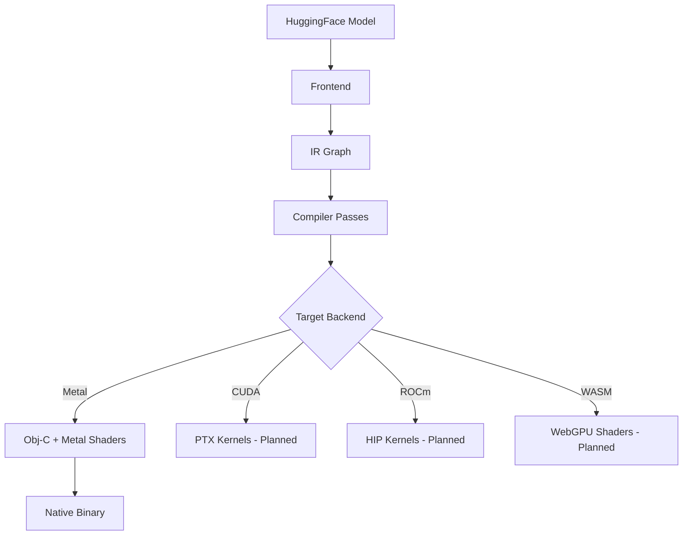

## Overview

UNC uses a multi-stage compilation pipeline that transforms HuggingFace transformer models into optimized native Metal binaries. The architecture is designed around a hardware-agnostic intermediate representation (IR) that enables aggressive optimization before lowering to target-specific code.



## Pipeline Stages

### 1. Frontend: Model Loading

The frontend (`src/frontend/`) handles HuggingFace model ingestion:

- **Config Parsing**: Extracts architecture parameters from `config.json`
- **Weight Loading**: Memory-maps `.safetensors` files without copying
- **Architecture Templates**: Model-specific lowering for LLaMA, Mistral, Qwen, Phi, Gemma

```rust
// From src/frontend/
let (arch, params, bos_id, eos_id) = parse_config(&config_json)?;
let model_files = loader.load(model_id)?;
```

<Note>
The frontend identifies the architecture family and selects the appropriate template for lowering to IR. Each template (`templates::llama`, `templates::qwen`, etc.) constructs a graph tailored to that model's unique patterns.
</Note>

### 2. IR Graph Construction

The IR (`src/ir/`) is a typed, hardware-agnostic tensor computation graph:

**Key Components** (`src/ir/graph.rs:16-26`):
- `Node`: A single operation with inputs, outputs, and kernel assignment
- `CompGraph`: The full DAG with metadata about the model
- `TensorRef`: Fully-resolved shape, dtype, and storage class

**Type System** (`src/ir/types.rs:38-44`):
```rust
pub enum Dim {
    Static(usize),         // Known at compile time (e.g., hidden_dim = 4096)
    Param(ParamDim),       // Runtime parameter (e.g., seq_len ∈ [1, 8192])
}
```

Weight dimensions are always `Static`, while batch/sequence dimensions are `Param` with known bounds. This enables the compiler to allocate for maximum size while dispatching for actual runtime dimensions.

### 3. Compiler Passes

The optimization pipeline (`src/compile/mod.rs:38-54`) runs multiple passes:

<Accordion title="Standard Pass Pipeline">
1. **Weight Binding Resolution**: Maps IR tensors to byte offsets in `.safetensors`
2. **Dead Code Elimination**: Removes unused nodes
3. **QKV Fusion**: Merges separate Query/Key/Value projections into single kernel
4. **Elementwise Fusion**: Combines operations like Add+RMSNorm
5. **Dual Path Insertion**: Creates separate prefill (GEMM) and decode (GEMV) paths
6. **Kernel Matching**: Assigns Metal kernels to each operation
7. **Layout Optimization**: Ensures tensors match kernel expectations (row-major)
8. **Memory Planning**: Computes buffer aliasing to minimize memory usage
9. **Scheduling**: Orders operations (already topological from template)
</Accordion>

**Example Fusion** (`src/compile/passes/qkv_fusion.rs`):
```
MatMul(W_q) + MatMul(W_k) + MatMul(W_v)
    ↓
Fused(QKVProjection { q_size, k_size, v_size })
```

### 4. Memory Planning

The memory planner (`src/compile/memory.rs:75-181`) uses greedy interval-graph coloring to reuse activation buffers whose lifetimes don't overlap:

```rust
// Activation buffers are aliased when lifetimes are disjoint
pub struct BufferLifetime {
    pub first_write: usize,  // Node index where tensor is produced
    pub last_read: usize,    // Node index where tensor is last consumed
}
```

<Note>
The planner creates separate decode regions for concurrent execution. Each region is a distinct MTLBuffer sized for `seq_len=1`, enabling efficient token-by-token generation.
</Note>

**Memory Categories**:
- **Weights**: mmap'd from safetensors at known byte offsets (read-only)
- **Activations**: Reusable buffers with lifetime-based aliasing
- **KV Cache**: Pre-allocated for `max_seq_len`, persistent across decode steps
- **Constants**: RoPE frequency tables, causal mask templates

### 5. Backend Code Emission

The Metal backend (`src/emit/metal.rs`) generates:

1. **Orchestrator Code**: Objective-C runtime that dispatches kernels
   - `unc_init()`: Allocates buffers, loads weights, compiles metallib
   - `unc_forward()`: Executes the graph for one forward pass

2. **Kernel Dispatch**: Each IR node becomes a Metal compute command:
   ```objective-c
   [encoder setComputePipelineState:kernel_matmul_q4];
   [encoder setBuffer:weight offset:0 atIndex:0];
   [encoder setBuffer:activation offset:0 atIndex:1];
   [encoder dispatchThreadgroups:grid threadsPerThreadgroup:tg];
   ```

3. **Dual-Path Execution**: Runtime branches on sequence length:
   - **Prefill** (`seq_len > 1`): GEMM kernels for parallel processing
   - **Decode** (`seq_len == 1`): Optimized GEMV kernels for single-token generation

<Warning>
The orchestrator code is JIT-compiled by clang on first run for `.unc` bundles, or statically linked for AOT binaries. Compilation takes 1-2 seconds but the result is cached.
</Warning>

## Kernel Registry

The kernel registry (`src/kernel/registry.rs`) maps IR operations to Metal shader implementations:

```rust
pub struct KernelRegistry {
    kernels: Vec<KernelSpec>,
    op_index: HashMap<Op, Vec<KernelId>>,
}
```

**Custom Kernels** (`kernel_sources/metal/unc_kernels/unc_kernels.metal`):
- Fused GEMV (Q4_0, Q8_0, F16)
- Scaled Dot-Product Attention (fused QK^T, softmax, attention @ V)
- RoPE (Rotary Position Embedding)
- RMSNorm, LayerNorm, QKNorm
- SwiGLU (fused gate + up projection)

**Upstream Kernels** (`kernel_sources/metal/upstream_mlx/`):
- MLX reference implementations for QMV operations
- SDPA vector processing headers

## Performance Characteristics

The compiled pipeline achieves:

- **1.35x faster** than mlx-lm (Q4_0 TinyLlama)
- **25% less GPU power** during decode
- **8.4x fewer CPU instructions** (no Python/framework overhead)
- **1.7x better energy efficiency** (74 mJ/token vs 125 mJ/token)

Key optimizations:
1. **Zero-copy weight loading**: mmap eliminates deserialization overhead
2. **Aggressive fusion**: QKV projection, SwiGLU, Add+RMSNorm combined
3. **Dual-path dispatch**: Separate optimized kernels for prefill vs decode
4. **Static memory plan**: No runtime allocation during inference
5. **Compiled execution**: Direct Metal API calls, no interpreter

## Extension Points

The architecture is designed for extensibility:

- **New Backends**: Implement `emit::cuda`, `emit::rocm` to target other GPUs
- **Custom Ops**: Add operations to `ir/ops.rs` and corresponding kernels
- **Optimization Passes**: Insert custom transformations in `compile/passes/`
- **Model Architectures**: Create templates in `frontend/templates/`

<Note>
The IR abstraction is key: any optimization or backend written against the IR works for all supported architectures (LLaMA, Mistral, Qwen, etc.) without model-specific code.
</Note>
