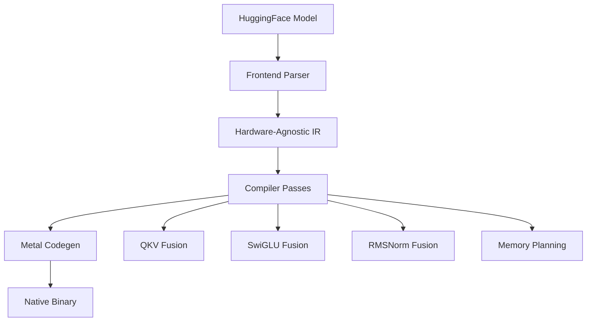

## Overview

The UNC Metal backend compiles transformer models into optimized native Metal compute kernels for Apple Silicon GPUs. It achieves **1.35x higher throughput** and **1.7x better energy efficiency** compared to mlx-lm by eliminating Python runtime overhead and framework dispatch layers.

<CardGroup cols={2}>
  <Card title="Performance" icon="gauge-high">
    152 tok/s on TinyLlama 1.1B (Q4_0, M1 Pro)
  </Card>
  <Card title="Energy Efficiency" icon="leaf">
    11.3W GPU power vs 14.1W (mlx-lm)
  </Card>
  <Card title="Memory Bandwidth" icon="memory">
    75-90% utilization on memory-bound ops
  </Card>
  <Card title="Kernel Fusion" icon="fire">
    7+ fusion patterns eliminate redundant passes
  </Card>
</CardGroup>

## Architecture

### Compilation Pipeline



### Dual-Path Execution

UNC uses a **dual-path strategy** for optimal performance across prefill and decode phases:

| Phase | Sequence Length | Path | Characteristics |
|-------|----------------|------|------------------|
| **Prefill** | > 1 | GEMM | Compute-bound, high arithmetic intensity |
| **Decode** | = 1 | GEMV | Memory-bound, streaming reads |

#### Prefill Path (GEMM)

- **Steel GEMM kernels**: Tiled matrix multiplication with threadgroup memory blocking
- **Tile sizes**: 32×32×16 (Apple7), 64×64×32 (Apple8+)
- **Utilization**: ~65% peak compute for FP16
- **Flash Attention**: Fused causal/non-causal SDPA with online softmax

#### Decode Path (GEMV)

- **Shared-memory-free**: Direct device memory reads (compact stride=1)
- **Vectorized**: half4 loads for 4× fewer memory transactions
- **Simdgroup reduction**: Efficient dot products across 32 threads
- **Fused QKV**: Single dispatch for Q+K+V projections

### Kernel Sources

The Metal backend uses two kernel libraries:

<CodeGroup>

```text UNC Custom Kernels
kernel_sources/metal/unc_kernels/
├── unc_kernels.metal       # 70+ kernels (RMSNorm, RoPE, SDPA, etc.)
└── mlx_kernels.metal       # MLX kernel instantiations (QMV, SDPA)
```

```text Upstream MLX Kernels
kernel_sources/metal/upstream_mlx/
├── gemv.metal              # Matrix-vector multiply
├── rms_norm.metal          # RMS normalization
├── rope.metal              # Rotary position embedding
├── scaled_dot_product_attention.metal
├── softmax.metal
├── quantized.metal         # Q4/Q8 quantized ops
├── mlx_qmv_fast.h          # Fast quantized GEMV templates
├── sdpa_vector.h           # Vectorized attention decode
└── steel/
    ├── gemm/kernels/       # Tiled GEMM (32×32, 64×64)
    └── attn/kernels/       # Flash Attention (prefill)
```

</CodeGroup>

### Tensor Layout Convention

All UNC Metal kernels follow a consistent memory layout:

```metal
// Activation tensors: [h, N_max]
// - h: hidden dimension (static)
// - N_max: sequence stride (dynamic batch size)

// Weight tensors: [h_out, h_in] (fully static)

// KV cache: [num_kv_heads, max_seq, head_dim] (per layer)
```

**Buffer binding convention** (all kernels):

```metal
[[buffer(0)]] = output
[[buffer(1)]] = input[0]
[[buffer(2)]] = input[1]   // if binary
[[buffer(3)]] = input[2]   // if ternary
[[buffer(4)]] = constant uint32_t params[8]
```

## Kernel Registry

Kernels are registered in `src/kernel/registry.rs` with:

- **OpPattern**: Single op, fused pattern, FlashAttention, GEMV, or GEMM
- **Constraints**: dtype, shape ranges, layout requirements
- **Dispatch template**: Grid/threadgroup size, shared memory
- **Performance model**: compute-bound, memory-bound, or roofline

The kernel matching pass selects the best kernel for each graph node based on:

1. **Pattern match**: Does the kernel implement this op/fusion?
2. **Constraint check**: Do input dtypes/shapes satisfy requirements?
3. **Cost estimation**: Memory bandwidth vs arithmetic intensity

### Example: GEMV Registration

```rust
KernelEntry {
    name: "gemv_f16".to_string(),
    op_pattern: OpPattern::GEMV { quantized: false, weight_dtype: None },
    input_constraints: vec![
        TensorConstraint::any(vec![DType::F16]), // x (vector)
        TensorConstraint::any(vec![DType::F16]), // W (matrix)
    ],
    output_dtype: DType::F16,
    source: KernelSource::MLX {
        file: "gemv.metal",
        variant: "gemv_f16",
    },
    dispatch_template: DispatchTemplate {
        threadgroup: [256, 1, 1],  // GEMV_TG_SIZE=256
        grid_rules: [
            GridRule::CeilDivOutputDim { axis: 0, tile_size: 64 },
            GridRule::Constant(1),
            GridRule::Constant(1),
        ],
        shared_memory_bytes: 0,  // shared-memory-free
    },
    perf_model: PerfModel::MemoryBound { utilization: 0.75 },
}
```

## Memory Management

### Buffer Aliasing

The compiler performs **liveness analysis** to reuse buffers:

```text
// Before aliasing
Buffer 0: [x_norm]           (4 MB)
Buffer 1: [qkv_proj]         (12 MB)
Buffer 2: [attn_out]         (4 MB)

// After aliasing
Buffer 0: [x_norm → attn_out]  (4 MB, reused)
Buffer 1: [qkv_proj]            (12 MB)

Memory savings: 33%
```

### Compact Decode Buffers

For decode (seq_len=1), activations use **stride=1** layout:

```text
// Standard layout: [h, N_max] where N_max = 8192
hidden[i] at offset: i * 8192 + 0

// Compact decode: [h, 1]
hidden[i] at offset: i * 1 + 0  (contiguous)

Cache efficiency: 4× better spatial locality
```

## Performance Characteristics

### Memory Bandwidth Utilization

| Kernel | Category | BW Utilization | Notes |
|--------|----------|----------------|-------|
| GEMV (decode) | Memory-bound | 75% | Weight streaming dominates |
| RMSNorm | Memory-bound | 80% | Two passes (reduce + scale) |
| RoPE | Memory-bound | 85% | Read-modify-write pattern |
| Softmax | Memory-bound | 80% | Three-pass (max, exp-sum, normalize) |
| GEMM (prefill) | Compute-bound | 65% | Tile reuse in SRAM |
| Flash Attention | Compute-bound | 70% | Fused QK^T + softmax + V |

### Dispatch Overhead

UNC Metal dispatch is **8.4× more efficient** than mlx-lm:

| Metric | UNC Metal | mlx-lm Q4 |
|--------|-----------|----------|
| CPU instructions (200 tokens) | 5.3B | 31.4B |
| Framework overhead | 0% | Python+JAX runtime |
| Kernel launches per token | ~15 | ~25 |

## Target-Specific Optimizations

### Apple GPU Families

UNC adapts to the target GPU:

```rust
match gpu_family {
    AppleGPUFamily::Apple7 => (32, 32, 16),  // M1, M2
    AppleGPUFamily::Apple8 => (64, 64, 32),  // M3
    AppleGPUFamily::Apple9 => (64, 64, 32),  // M4 (+ BF16)
}
```

**Apple9+ (M4)** gains:
- Native BF16 support (4-bit wider exponent range)
- Larger threadgroup memory (64 KB)
- Hardware ray tracing acceleration (not used for LLM inference)

## Quantization Support

| Format | Precision | Group Size | Decode Speed | Use Case |
|--------|-----------|------------|--------------|----------|
| **F16** | 16-bit | N/A | 47.9 tok/s | Highest quality |
| **Q8_0** | 8-bit | 32 | 76.6 tok/s | Balanced |
| **Q4_0** | 4-bit | 32 | 152.0 tok/s | Maximum throughput |

**Q4_0_FAST** kernel layout:

```metal
struct Q4_0_Block {
    half scale;           // FP16 scale factor
    uint8_t qs[16];       // 32 packed 4-bit values (2 per byte)
};
```

## Next Steps

<CardGroup cols={2}>
  <Card title="Metal Kernels" icon="code" href="/metal/kernels">
    Detailed documentation of all Metal kernels
  </Card>
  <Card title="Fusion Patterns" icon="layer-group" href="/metal/fusion-patterns">
    Multi-op fusion strategies and performance
  </Card>
</CardGroup>
